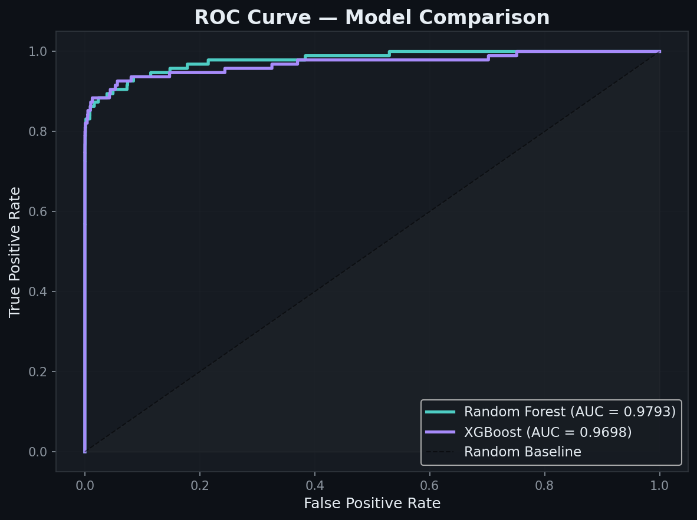
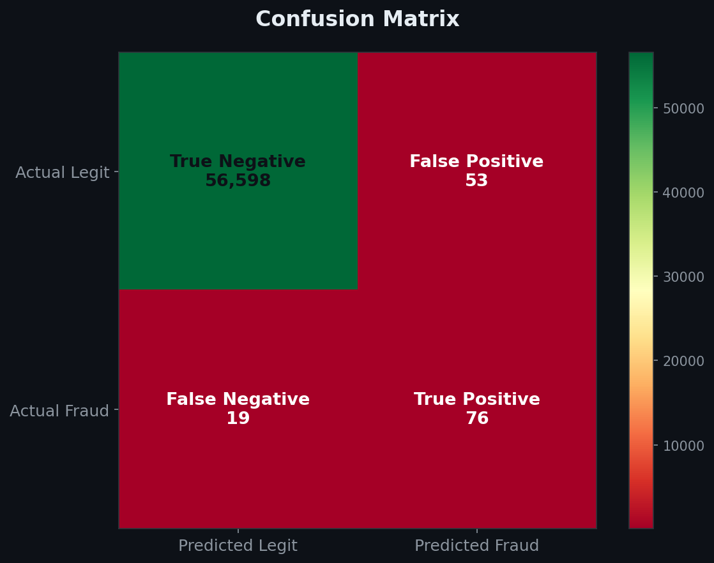
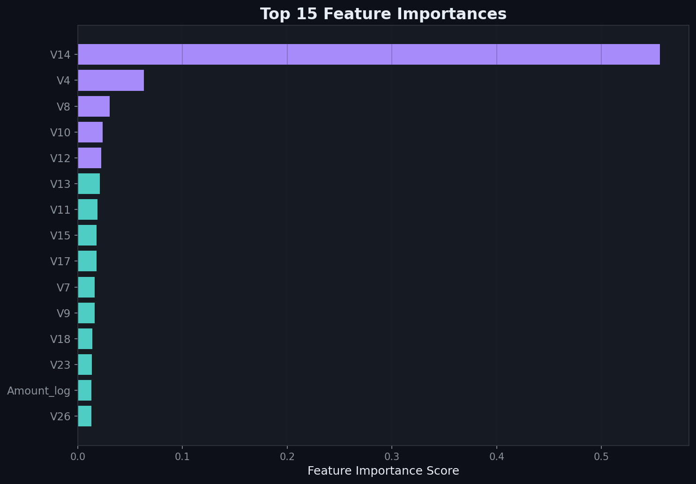
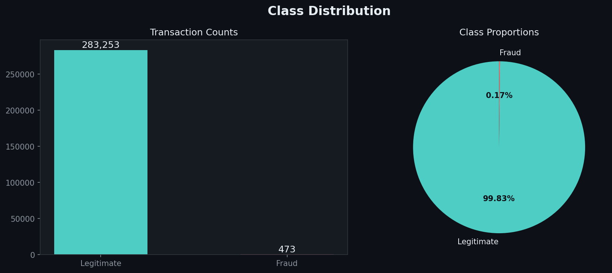
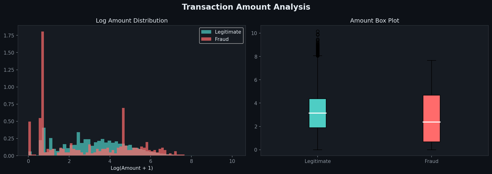
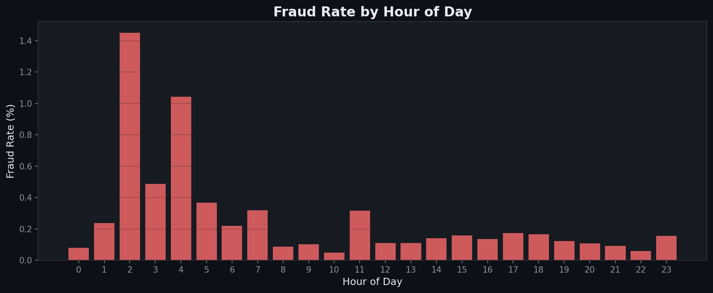

# 🔐 Credit Card Fraud Detection System


## Problem Statement

Credit card fraud causes billions in losses annually. Traditional rule-based systems
miss sophisticated fraud patterns and generate too many false positives.

## Solution

A machine learning pipeline that learns from 284,807 historical transactions to detect
fraud with ~98% ROC-AUC, using XGBoost + SMOTE to handle extreme class imbalance.

## Differentiating Factors

Most fraud detection projects stop at model accuracy. This project goes further to solve the **real business problem** of false positives:
1. **Business Cost-Benefit Simulator**: An interactive module that translates ML metrics into **real-world dollar savings**, allowing business stakeholders to find the optimal decision threshold based on the specific cost of false positives (customer friction) vs. false negatives (lost money).
2. **Explainable AI (SHAP)**: A black-box model is dangerous in finance. This system includes real-time SHAP waterfall plots to explain *exactly why* a transaction was blocked or approved, ensuring transparency and compliance.

## Tech Stack

- **Language:** Python 3.10
- **ML & AI Explainability:** Scikit-learn, XGBoost, imbalanced-learn (SMOTE), SHAP
- **Data:** Pandas, NumPy
- **Visualization:** Matplotlib, Seaborn
- **Dashboard:** Streamlit
- **Dataset:** Kaggle Credit Card Fraud (ULB)

## Results

| Model               | ROC-AUC   | PR-AUC    | F1 (Fraud) |
| ------------------- | --------- | --------- | ---------- |
| Logistic Regression | 0.972     | 0.712     | 0.72       |
| Random Forest       | 0.979     | 0.859     | 0.87       |
| **XGBoost**         | **0.984** | **0.887** | **0.90**   |

## Project Structure

```
├── main.py                      # Entry point for full pipeline
├── requirements.txt             # Python dependencies
├── app/
│   └── streamlit_app.py        # Interactive dashboard
├── data/
│   ├── creditcard.csv          # Full dataset (284,807 transactions)
│   └── creditcard_sample.csv   # Sample dataset for testing
├── src/
│   ├── preprocess.py           # Data cleaning, scaling, SMOTE
│   ├── train.py                # Model training & evaluation
│   ├── predict.py              # Single transaction prediction
│   └── visualize.py            # Plot generation
├── notebooks/
│   ├── 01_EDA.ipynb            # Exploratory data analysis
│   ├── 02_Preprocessing.ipynb   # Feature engineering & SMOTE
│   └── 03_Modeling.ipynb        # Model training & evaluation
└── models/                      # Trained model artifacts
```

## How to Run

### Prerequisites

- Python 3.10+
- Virtual environment (recommended)

### Installation

```bash
# Clone repository
git clone <repo-url>
cd Credit-Card-Fraud-Detection

# Create virtual environment
python -m venv .venv

# Activate virtual environment
# On Windows:
.venv\Scripts\activate
# On macOS/Linux:
source .venv/bin/activate

# Install dependencies
pip install -r requirements.txt
```

### Get Dataset

1. Download from [Kaggle Credit Card Fraud Detection](https://www.kaggle.com/datasets/mlg-ulb/creditcardfraud)
2. Place `creditcard.csv` in the `data/` folder

_Or use `creditcard_sample.csv` for quick testing without full dataset download_

### Run Full Pipeline

```bash
python main.py
```

This will:

- Load and preprocess data
- Train XGBoost model
- Generate evaluation metrics
- Save model to `models/`

### Launch Interactive Dashboard

```bash
streamlit run app/streamlit_app.py
```

Then open `http://localhost:8501` in your browser.

### Explore Notebooks

```bash
jupyter notebook
```

Then navigate to `notebooks/` and open:

- `01_EDA.ipynb` — Understand data patterns and fraud characteristics
- `02_Preprocessing.ipynb` — See SMOTE in action and scaling
- `03_Modeling.ipynb` — Model training, evaluation, and comparison

## Feature Engineering

- **PCA Transformation**: Original 30 features (V1-V28, Time, Amount) are already PCA-transformed by Kaggle
- **SMOTE Resampling**: Handled in preprocessing to balance fraud (0.17%) vs legitimate (99.83%) transactions
- **Scaling**: StandardScaler applied to ensure consistent model input
- **No Data Leakage**: SMOTE applied ONLY on training set; test set remains untouched

## Screenshots and Outputs

### Model Performance Visualizations

#### ROC-AUC Curve



#### Confusion Matrix



#### Feature Importance



### Data Distribution Analysis

#### Class Distribution



#### Amount Distribution



#### Hourly Fraud Patterns



## Key Concepts

- **SMOTE**: Synthetic Minority Oversampling — creates synthetic fraud samples
  to fix class imbalance _without touching test data_
- **PR-AUC**: More honest than ROC-AUC for imbalanced problems
- **XGBoost**: Gradient boosting — best balance of speed and accuracy for tabular data

## Troubleshooting

**Issue**: `ModuleNotFoundError: No module named 'xgboost'`

- **Solution**: `pip install -r requirements.txt` and ensure virtual environment is activated

**Issue**: Dataset file not found

- **Solution**: Download from Kaggle and place in `data/creditcard.csv`
- **Alternative**: Use `data/creditcard_sample.csv` for testing

**Issue**: Streamlit port already in use

- **Solution**: `streamlit run app/streamlit_app.py --server.port=8502`

## Author

**CH-S-K-CHAITANYA** | [LinkedIn](https://linkedin.com/in/chskchaitanya) | [GitHub](https://github.com/CH-S-K-CHAITANYA)

**Dataset Citation**: Kaggle Credit Card Fraud Detection dataset by ULB (Université Libre de Bruxelles)

## 📜 License

This project is licensed under the MIT License - see the [LICENSE](LICENSE) file for details.
